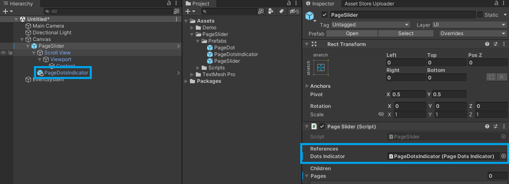

# Using Predefined Content

This guide walks you through creating a Page Slider with a predefined set of pages and content.

> [!Video https://www.youtube.com/embed/FKAQVJ91ioI]

## 1. Add the Page Slider

1. Create a new `Canvas` GameObject.
2. In the Project window, locate the `PageSlider` prefab within your project's folder structure: `PageSlider/Prefabs/`.
3. Drag the `PageSlider` prefab from the Project window and make it a child of the `Canvas` in the Hierarchy.

## 2. (Optional) Add Page Dots Indicator

1. In the Project window, locate the `PageDotsIndicator` prefab within your project's folder structure: `PageSlider/Prefabs/`.
2. Drag the `PageDotsIndicator` prefab and make it a child of the `PageSlider` in the Hierarchy.

3. In the Inspector window, assign the `PageDotsIndicator` to the `Dots Indicator` field.

## 3. Add a new Page

1. Select the `PageSlider` GameObject.
2. Click the `Add Page` button in the Inspector window.

3. Expand the `PageSlider` hierarchy to locate the newly created `Page_X/Content` GameObject.

4. Select the `Content` GameObject and add your desired UI elements to configure the page layout.

5. Repeat the previous steps to add more pages.

## Helpful links

- Understand the main concepts by reading the [getting started guide](./getting-started.md)
- For a more in-depth explanation, check out this [video](https://youtu.be/Z3K6qApmTsY).
- Explore the [API Reference](../api/TS.PageSlider.PageSlider.html) for more details.
- Modify the source code available on [GitHub](https://github.com/tomazsaraiva/unity-canvas-page-slider).
- Install directly from the [Unity Asset Store](https://assetstore.unity.com/packages/tools/gui/page-slider-241341).
- Get in touch with me at [tomazsaraiva.com](https://tomazsaraiva.com).
