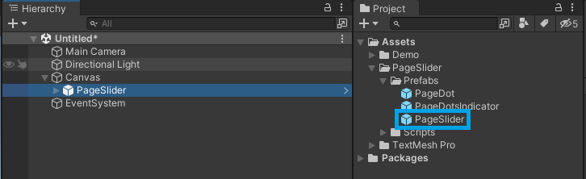
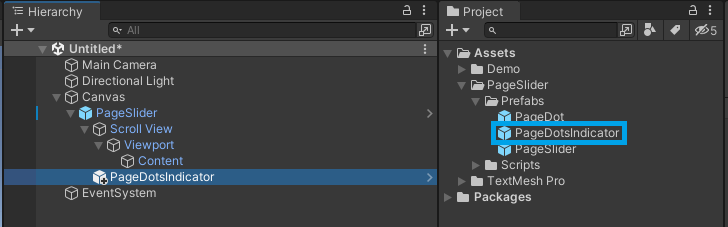
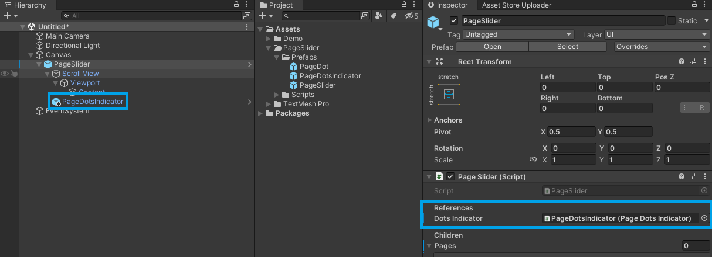
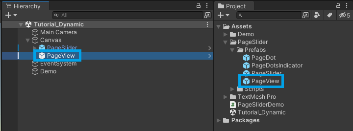
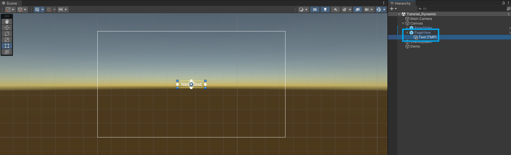
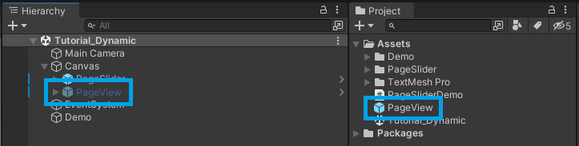
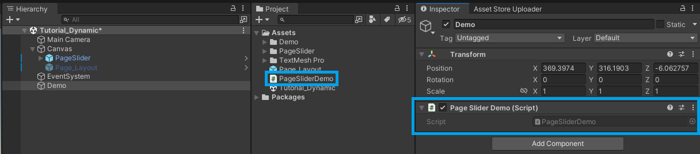
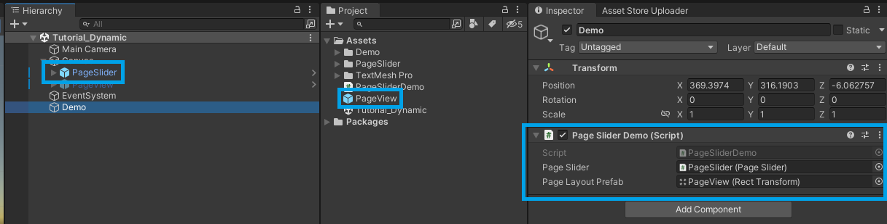

# Implementing Dynamic Content

This tutorial explores loading content dynamically into your Page Slider at runtime, allowing for greater control and adaptability.

## 1. Add the Page Slider

1. Create a new `Canvas` GameObject.
2. In the Project window, locate the `PageSlider` prefab within your project's folder structure: `PageSlider/Prefabs/`.
3. Drag the `PageSlider` prefab from the Project window and make it a child of the `Canvas` in the Hierarchy.



## 2. (Optional) Add Page Dots Indicator

1. In the Project window, locate the `PageDotsIndicator` prefab within your project's folder structure: `PageSlider/Prefabs/`.
2. Drag the `PageDotsIndicator` prefab and make it a child of the `PageSlider` in the Hierarchy.



3. Select the `PageSlider` GameObject.
4. In the Inspector window, assign the `PageDotsIndicator` to the `Dots Indicator` field.



## 3. Create a Page View

1. Select the `Canvas` GameObject.
2. In the Project window, locate the `PageView` prefab within your project's folder structure: `PageSlider/Prefabs/`.
3. Drag the `PageView` prefab from the Project window and make it a child of the `Canvas` in the Hierarchy.



4. Add your desired UI elements to configure the `PageView` layout. In this example, I'm adding a single Label, but the layout can be as complex as you need.



1. Create a new prefab for the `PageView` layout. The Page Slider will instantiate this prefab at runtime to generate each page.
2. Disable or remove the page layout from the Scene.



## 4. Add Pages at runtime

1. Create a new C# script (or use an existing one).



1. Create a reference to the `PageSlider` and the `PageView` prefab.
2. Instantiate the pages that you want and configure their properties.
3. Add the pages to the `PageSlider` using the [AddPage](../api/TS.PageSlider.PageSlider.html#TS_PageSlider_PageSlider_AddPage_RectTransform_) method. Please note it accepts a `RectTransform` component.

``` csharp
using TMPro;
using TS.PageSlider;
using UnityEngine;

public class PageSliderDemo : MonoBehaviour
{
    public PageSlider _pageSlider;
    public PageView _pageView;

    void Start()
    {
        for (int i = 0; i < 3; i++)
        {
            var page = Instantiate(_pageView);
            page.GetComponentInChildren<TextMeshProUGUI>().text = i.ToString();

            _pageSlider.AddPage((RectTransform)page.transform);
        }
    }
}
```

1. Assign the `PageSlider` and the `PageView` prefab references.



6. Run the project and the pages will be added dynamically to the `PageSlider`.

**Note:** For more complex cases you should create a custom class for the page layout. Check the `Demo_Dynamic` and `Demo_Lazy` available on the [GitHub repository](https://github.com/tomazsaraiva/unity-canvas-page-slider).
